# SGLang 架构设计与核心模块分析

## 目录
1. [整体架构概览](#整体架构概览)
2. [入口层设计](#入口层设计)
3. [管理层架构](#管理层架构)
4. [调度核心层](#调度核心层)
5. [模型执行层](#模型执行层)
6. [基础层设计](#基础层设计)
7. [分布式并行层](#分布式并行层)
8. [核心数据流](#核心数据流)
9. [性能优化设计](#性能优化设计)

---

## 整体架构概览

### 高层架构图

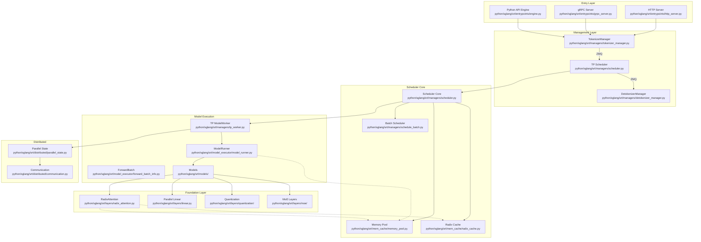

### 架构特性说明

**分层设计原则：**
1. **接口层隔离**：HTTP/gRPC/Python API 提供统一的接口抽象
2. **进程间通信**：使用 ZMQ 实现高效的进程间消息传递
3. **职责分离**：Tokenizer、Scheduler、Detokenizer 分别处理不同阶段
4. **内存统一管理**：集中式内存池和 RadixCache 优化内存使用
5. **模型抽象**：统一的模型接口支持 100+ 模型
6. **分布式透明**：底层分布式通信对上层的透明化

---

## 入口层设计

### 入口层架构

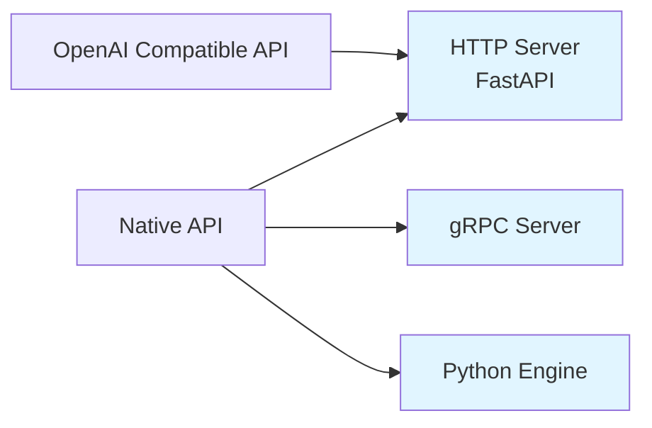

### 关键组件说明

**HTTP Server** (`python/sglang/srt/entrypoints/http_server.py`)
- 基于 FastAPI 实现
- 提供 OpenAI 兼容接口
- 支持流式响应和异步处理
- 集成 CORS 和健康检查

**gRPC Server** (`python/sglang/srt/entrypoints/grpc_server.py`)
- 独立的 gRPC 服务进程
- 使用 GrpcRequestManager 编排请求
- 支持双向流式通信

**Engine** (`python/sglang/srt/entrypoints/engine.py`)
- Python API 入口
- 管理三个子进程：Tokenizer、Scheduler、Detokenizer
- 使用 ZMQ 进行 IPC

**launch_server.py** (`python/sglang/launch_server.py`)
- 主要的启动入口点
- 选择启动 HTTP 或 gRPC 服务器
- 根据配置参数初始化服务

---

## 管理层架构

### 管理层组件交互

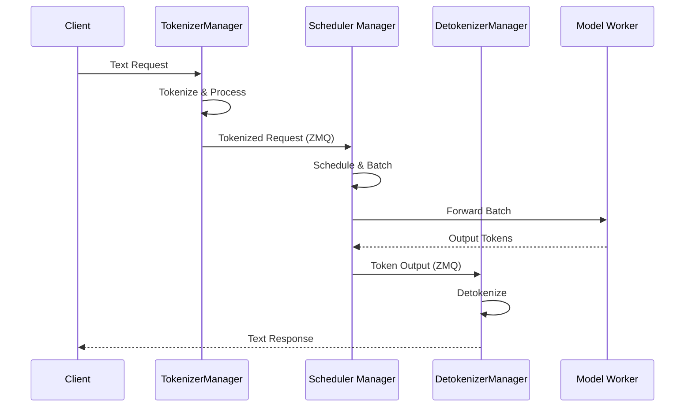

### 管理层组件详解

#### TokenizerManager
**位置**: `python/sglang/srt/managers/tokenizer_manager.py`

**核心职责：**
- 文本分词和预处理
- 多模态数据处理（AsyncMMDataProcessor）
- LoRA 适配器管理
- 会话管理

**关键流程：**
```
接收请求 → 分词 → 应用模板 → 处理多模态 → 发送到调度器
```

#### Scheduler Manager
**位置**: `python/sglang/srt/managers/scheduler.py`

**架构特点：**
- 继承多个 Mixin 类实现功能组合（共9个Mixin）：
  - `SchedulerOutputProcessorMixin`: 输出处理
  - `SchedulerUpdateWeightsMixin`: 权重更新
  - `SchedulerProfilerMixin`: 性能分析
  - `SchedulerMetricsMixin`: 指标收集
  - `SchedulerDisaggregationDecodeMixin`: PD分离（解码阶段）
  - `SchedulerDisaggregationPrefillMixin`: PD分离（预填充阶段）
  - `SchedulerMultiplexMixin`: 多路复用支持
  - `SchedulerRuntimeCheckerMixin`: 运行时检查
  - `SchedulerPPMixin`: 流水线并行支持

**核心功能：**
- 请求生命周期管理
- 批处理调度
- 内存管理
- 前缀缓存管理

#### DetokenizerManager
**位置**: `python/sglang/srt/managers/detokenizer_manager.py`

**核心职责：**
- Token 到文本的转换
- 流式响应处理
- 输出后处理

---

## 调度核心层

### 调度核心架构

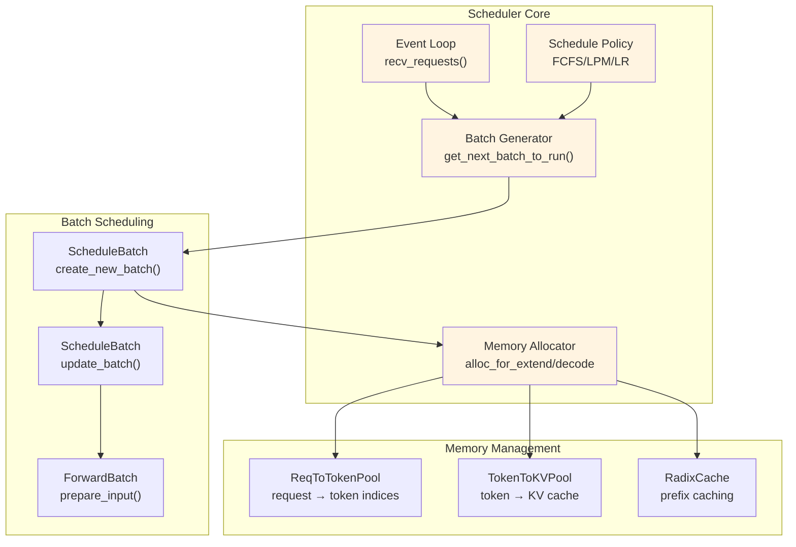

### 核心组件详解

#### 1. Scheduler Core
**位置**: `python/sglang/srt/managers/scheduler.py`

**主要方法：**
- `event_loop()`: 主事件循环
- `get_next_batch_to_run()`: 获取下一个执行批次
- `run_batch()`: 执行批次推理
- `process_batch_result()`: 处理推理结果

#### 2. Batch Scheduling
**位置**: `python/sglang/srt/managers/`

**核心组件：**
- **ScheduleBatch**: 管理一批请求
  - `create_new_batch()`: 创建新批次
  - `update_batch()`: 更新批次状态
  - `merge()`: 合并批次
  - `filter_batch()`: 过滤完成的请求

- **ForwardBatch**: 准备模型输入
  - `prepare_input()`: 生成模型前向输入
  - 管理 attention metadata、input_ids、positions 等

- **SchedulePolicy**: 调度策略
  - FCFS (First Come First Serve)
  - LPM (Longest Prefix Match)
  - LRU、LFU、MRU 等缓存策略
  - 支持缓存感知和缓存无关策略

#### 3. Memory Management
**位置**: `python/sglang/srt/mem_cache/`

**两级内存池架构：**

**ReqToTokenPool**:
- 映射：request → token indices
- 结构: `[batch_size, max_seq_len]` 的张量
- 管理每个请求的 token 位置

**TokenToKVPool**:
- 映射：token → KV cache storage
- 实现: 连续的 KV 缓存张量
- 支持动态分配和回收

**Memory Allocator 关键方法：**
```python
def alloc_for_extend(batch: ScheduleBatch):
    # 为预填充分配内存
    # 支持分块预填充

def alloc_for_decode(batch: ScheduleBatch):
    # 为解码分配单 token 内存
```

#### 4. RadixCache - 前缀缓存
**位置**: `python/sglang/srt/mem_cache/radix_cache.py`

**RadixTree 结构：**
```python
class TreeNode:
    children: Dict[|RadixKey, TreeNode|]  # 子节点映射
    parent: TreeNode                    # 父节点引用
    key: RadixKey                       # 节点键值
    value: Tensor                       # KV cache 索引
    lock_ref: int                       # 引用计数
```

**核心算法：**
- **match_prefix**: 查找最长匹配前缀
  ```
  从根节点开始
  逐页比较 token 序列
  返回匹配的 KV 缓存索引
  ```

- **insert**: 插入新序列
  ```
  沿树遍历
  在分叉点创建新节点
  更新引用计数
  ```

- **evict**: 缓存替换
  ```
  根据策略选择节点（LRU/LFU/FIFO/MRU）
  递归删除子树
  释放内存
  ```

**性能优化：**
- 分页匹配（page_size 优化）
- 引用计数防止使用中的缓存被删除
- Bigram 支持（为 EAGLE 推测解码优化）

### 调度策略对比

| 策略 | 类型 | 优点 | 适用场景 |
|------|------|------|----------|
| FCFS | 缓存无关 | 简单公平 | 通用场景 |
| LPM | 缓存感知 | 最大化缓存复用 | 长前缀场景 |
| LRU | 缓存替换 | 利用局部性 | 缓存管理 |
| LFU | 缓存替换 | 利用频率 | 热门请求 |
| DFS-Weight | 缓存感知 | 平衡负载 | 多前缀场景 |

---

## 模型执行层

### 模型执行架构

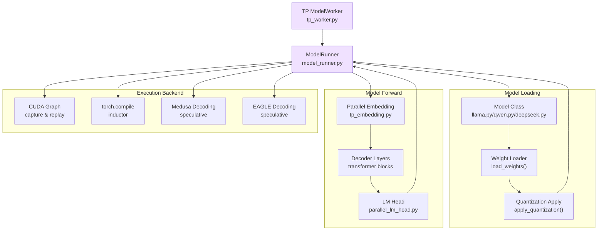

### 模型执行流程详解

#### 1. 模型加载阶段

**ModelRunner 初始化** (`python/sglang/srt/model_executor/model_runner.py`)

**加载流程：**
```
1. 加载模型配置
2. 创建模型实例（延迟初始化）
3. 加载模型权重
4. 应用量化配置
5. 初始化内存池
6. 准备 CUDA Graph（如启用）
```

**关键方法：**
- `load_model()`: 加载模型实例
- `init_memory_pool()`: 初始化 KV 缓存内存池
- `update_weights()`: 动态权重更新（支持 LoRA）

#### 2. 模型前向执行

**前向流程：**
```python
def forward(batch: ForwardBatch, forward_mode: ForwardMode):
    # 1. 准备输入
    input_ids = batch.input_ids
    positions = batch.positions
    forward_batch = ForwardBatch.build(batch)

    # 2. 嵌入层
    hidden_states = model.embed_tokens(input_ids)

    # 3. 解码器层循环
    for layer in model.layers:
        hidden_states = layer(hidden_states, forward_batch)

    # 4. 输出层
    logits = model.lm_head(hidden_states)

    return logits
```

#### 3. 模型架构抽象

**统一模型接口：**
```python
class XXXForCausalLM(nn.Module):
    def __init__(self, config, quant_config=None):
        self.model = XXXModel(config, quant_config)
        self.lm_head = ParallelLMHead(config.vocab_size, config.hidden_size)
        self.logits_processor = LogitsProcessor(config)

    def forward(self, input_ids, positions, forward_batch):
        hidden_states = self.model(input_ids, positions, forward_batch)
        logits = self.lm_head(hidden_states)
        return logits

class XXXModel(nn.Module):
    def __init__(self, config, quant_config):
        self.embed_tokens = VocabParallelEmbedding(...)
        self.layers = nn.ModuleList([
            XXXDecoderLayer(config, quant_config)
            for _ in range(config.num_hidden_layers)
        ])
        self.norm = RMSNorm(config.hidden_size, eps=config.rms_norm_eps)

    def forward(self, input_ids, positions, forward_batch):
        hidden_states = self.embed_tokens(input_ids)
        for layer in self.layers:
            hidden_states = layer(hidden_states, positions, forward_batch)
        hidden_states = self.norm(hidden_states)
        return hidden_states
```

**DecoderLayer 结构：**
```python
class XXXDecoderLayer(nn.Module):
    def __init__(self, config, quant_config):
        self.self_attn = XXXAttention(config, quant_config)
        self.mlp = XXXMLP(config, quant_config)
        self.input_layernorm = RMSNorm(config.hidden_size)
        self.post_attention_layernorm = RMSNorm(config.hidden_size)

    def forward(self, hidden_states, positions, forward_batch):
        # 自注意力
        residual = hidden_states
        hidden_states = self.input_layernorm(hidden_states)
        hidden_states = self.self_attn(hidden_states, positions, forward_batch)
        hidden_states = residual + hidden_states

        # 前馈网络
        residual = hidden_states
        hidden_states = self.post_attention_layernorm(hidden_states)
        hidden_states = self.mlp(hidden_states)
        hidden_states = residual + hidden_states

        return hidden_states
```

#### 4. 执行优化技术

**CUDA Graph**:
- 捕获模型前向图
- 减少 kernel 启动开销
- 支持动态 batch size（通过 padding）

**torch.compile**:
- 使用 inductor 后端
- 自动算子融合
- 支持动态 shape

**推测解码**:
- Medusa: 多分支推测
- EAGLE: 基于上下文感知
- 共享 KV 缓存

---

## 基础层设计

### 基础层架构

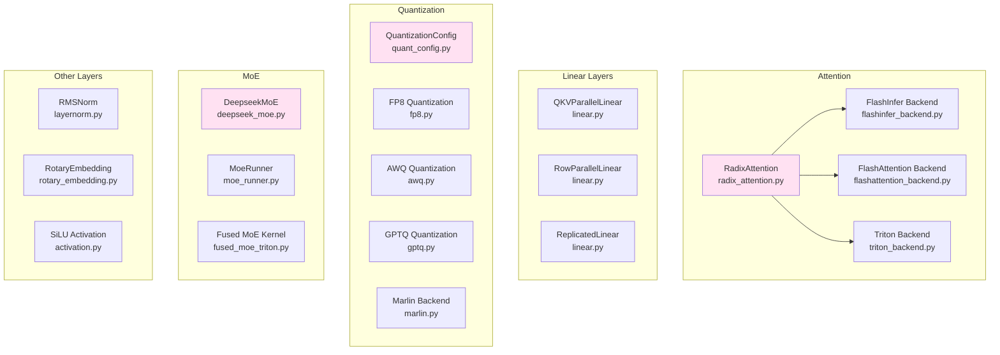

### 核心基础组件详解

#### 1. RadixAttention - 统一注意力接口

**位置**: `python/sglang/srt/layers/radix_attention.py`

**核心职责：**
- 提供统一的注意力接口
- 管理前缀缓存
- 路由到不同后端

**类设计：**

```python
class RadixAttention(nn.Module):
    def __init__(self, num_heads, head_dim, scaling, num_kv_heads,
                 layer_id, logit_cap=0, v_head_dim=None):
        # 初始化注意力参数
        self.tp_q_proj = QKVParallelLinear(...)
        self.tp_k_proj = QKVParallelLinear(...)
        self.tp_v_proj = QKVParallelLinear(...)
        self.tp_o_proj = RowParallelLinear(...)

        # 创建注意力后端
        if backend == "flashinfer":
            self.backend = FlashInferAttnBackend(...)
        elif backend == "triton":
            self.backend = TritonAttnBackend(...)
        elif backend == "flashattention":
            self.backend = FlashAttentionBackend(...)

    def forward(self, q, k, v, forward_batch: ForwardBatch):
        if forward_batch.forward_mode == ForwardMode.PREFILL:
            return self.backend.forward_extend(q, k, v, forward_batch)
        else:
            return self.backend.forward_decode(q, k, v, forward_batch)
```

**核心组件依赖关系：**

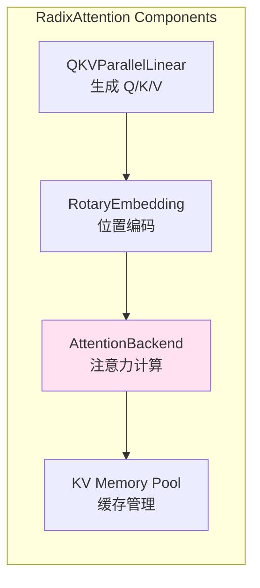

#### 2. 注意力后端架构

**多后端设计原则：**
1. **接口统一**：所有后端实现相同的基类接口
2. **性能最优**：根据场景自动选择最优后端
3. **功能互补**：不同后端支持不同特性

**支持的后端：**
- **FlashInferBackend**: NVIDIA GPU 的高性能后端（默认）
- **FlashAttentionBackend**: 通用后端
- **TritonBackend**: 灵活的研究后端
- **XPUAttentionBackend**: Intel XPU 支持
- **AscendBackend**: 华为 Ascend NPU 支持
- **IntelAMXBackend**: Intel AMX 优化
- **WaveBackend**: Wave Computing 支持

**后端对比：**

**FlashInfer Backend**
```python
class FlashInferAttnBackend(AttentionBackend):
    def forward_extend(self, q, k, v, forward_batch):
        # 使用 prefill attention kernel
        # 支持 ragged attention 和 paged attention
        o = flashinfer.prefill_attention(q, k, v, ...)
        return o

    def forward_decode(self, q, k, v, forward_batch):
        # 使用 decode attention kernel
        o = flashinfer.decode_attention(q, k, v, ...)
        return o
```

**特点：**
- 基于预编译 CUDA kernel
- 自动选择最优算法
- 支持 page attention 和 ragged attention
- 性能最优，适合生产环境

**Triton Backend**
```python
class TritonAttnBackend(AttentionBackend):
    def forward_extend(self, q, k, v, forward_batch):
        # 使用 triton 实现的 attention
        o = triton_attention_extend(q, k, v, ...)
        return o

    def forward_decode(self, q, k, v, forward_batch):
        o = triton_attention_decode(q, k, v, ...)
        return o
```

**特点：**
- 纯 Python + Triton 实现
- 易于修改和调试
- 支持 tree attention（用于推测解码）
- 灵活性高，适合研究

**后端选择逻辑：**
```python
def select_attention_backend(attn_backend, kv_cache_dtype, device):
    if attn_backend == "flashinfer" and device == "cuda":
        return "flashinfer"
    elif attn_backend == "triton":
        return "triton"
    elif device == "cuda":
        return "flashattention"
    else:
        return "torch_native"
```

**后端性能对比：**

| 后端 | 性能 | 显存 | 灵活性 | 适用场景 | 支持硬件 |
|------|------|------|--------|----------|----------|
| FlashInfer | ⭐⭐⭐⭐⭐ | ⭐⭐⭐⭐ | ⭐⭐⭐ | 生产环境 | NVIDIA GPU |
| FlashAttention | ⭐⭐⭐⭐ | ⭐⭐⭐ | ⭐⭐⭐ | 通用场景 | NVIDIA GPU |
| Triton | ⭐⭐⭐ | ⭐⭐⭐⭐ | ⭐⭐⭐⭐⭐ | 研究/定制 | NVIDIA GPU |
| XPUAttention | ⭐⭐⭐⭐ | ⭐⭐⭐ | ⭐⭐⭐ | Intel GPU | Intel GPU |
| Ascend | ⭐⭐⭐ | ⭐⭐⭐ | ⭐⭐⭐ | 华为NPU | Ascend NPU |
| Torch Native | ⭐⭐ | ⭐⭐ | ⭐⭐⭐⭐ | 调试/开发 | All |

**选择建议：**
- **生产环境**: FlashInfer（性能最优）
- **通用场景**: FlashAttention（兼容性好）
- **研究/实验**: Triton（易于修改）
- **调试**: Torch Native（易于理解）

#### 3. 并行线性层

**层次结构：**

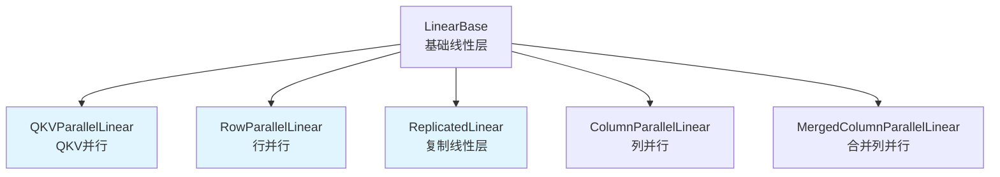

**QKVParallelLinear**
- 将 Q/K/V 投影并行化
- 输出维度按 TP 维度切分
- 用于注意力层的 Q/K/V 投影

**RowParallelLinear**
- 行并行线性层
- 输入维度按 TP 维度切分
- 用于注意力输出和 MLP 输出投影
- 需要 all-reduce 聚合结果

**ReplicatedLinear**
- 权重在所有 TP  rank 复制
- 用于路由网络（MoE）
- 用于 lm_head

**关键实现细节：**
```python
class QKVParallelLinear(ColumnParallelLinear):
    def create_weights(self, input_size, output_size):
        # 输出按 TP 切分
        output_size_per_partition = output_size // tp_size
        self.weight = Parameter(torch.empty(
            output_size_per_partition, input_size
        ))

class RowParallelLinear(LinearBase):
    def create_weights(self, input_size, output_size):
        # 输入按 TP 切分
        input_size_per_partition = input_size // tp_size
        self.weight = Parameter(torch.empty(
            output_size, input_size_per_partition
        ))

    def forward(self, x):
        output = F.linear(x, self.weight)
        # all-reduce 聚合
        output = all_reduce(output, tp_group)
        return output

class ColumnParallelLinear(LinearBase):
    def create_weights(self, input_size, output_size):
        # 输出按 TP 切分
        output_size_per_partition = output_size // tp_size
        self.weight = Parameter(torch.empty(
            output_size_per_partition, input_size
        ))

class MergedColumnParallelLinear(ColumnParallelLinear):
    # 合并多个列并行层（如 MLP 的 gate 和 up 投影）
    pass
```

**线性层性能优化：**
1. **权重布局优化**: 预转置权重以匹配计算格式
2. **融合操作**: 线性 + bias + activation 融合
3. **特殊格式**: Marlin/AWQ/GPTQ 等量化格式优化
4. **异步通信**: 计算和通信重叠

#### 4. 量化系统设计

**量化架构：**

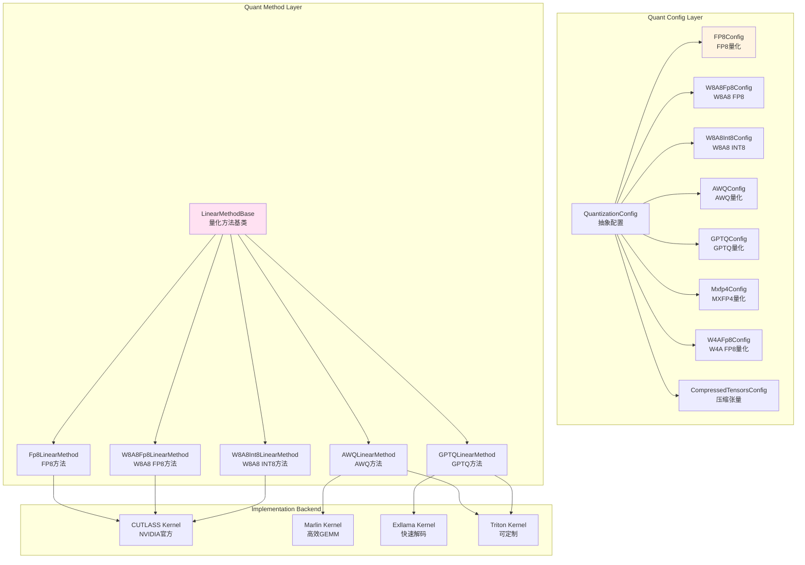

**量化配置示例：**

**FP8 量化配置：**
```python
@dataclass
class Fp8Config(QuantizationConfig):
    is_checkpoint_fp8_serialized: bool = False
    activation_scheme: str = "static"  # or "dynamic"

    def get_quant_method(self, layer, prefix):
        from sglang.srt.layers.quantization.fp8 import Fp8LinearMethod
        return Fp8LinearMethod(self)
```

**AWQ 量化配置：**
```python
@dataclass
class AWQConfig(QuantizationConfig):
    weight_bits: int = 4
    group_size: int = 128
    zero_point: bool = True

    def get_quant_method(self, layer, prefix):
        from sglang.srt.layers.quantization.awq import AWQLinearMethod
        return AWQLinearMethod(self)
```

**量化方法实现：**

**FP8LinearMethod**
```python
class Fp8LinearMethod(LinearMethodBase):
    def __init__(self, quant_config: Fp8Config):
        self.quant_config = quant_config

    def create_weights(self, layer, input_size, output_size):
        # 创建 FP8 权重
        layer.weight = Parameter(torch.empty(
            output_size, input_size, dtype=torch.float8_e4m3fn
        ))
        # FP8 缩放因子
        layer.weight_scale = Parameter(torch.empty(output_size))

    def apply(self, layer, x, bias=None):
        # FP8 矩阵乘
        qinput, input_scale = dynamic_quantize_fp8(x)
        qweight = layer.weight
        output = block_fp8_mm(qinput, qweight, input_scale, layer.weight_scale)
        return output
```

**AWQLinearMethod**
```python
class AWQLinearMethod(LinearMethodBase):
    def __init__(self, quant_config: AWQConfig):
        self.quant_config = quant_config

    def create_weights(self, layer, input_size, output_size):
        # 创建量化权重
        qweight = Parameter(torch.empty(
            output_size // 8 * self.quant_config.weight_bits,
            input_size,
            dtype=torch.int32
        ))
        scales = Parameter(torch.empty(
            output_size // self.quant_config.group_size
        ))
        layer.qweight = qweight
        layer.scales = scales

    def apply(self, layer, x, bias=None):
        # 使用 Marlin kernel 进行量化矩阵乘
        output = marlin_gemm(x, layer.qweight, layer.scales)
        return output
```

**量化性能对比：**

| 量化方法 | 压缩率 | 性能损失 | 推理速度 | 显存节省 |
|----------|--------|----------|----------|----------|
| FP8      | 50%    | ~0%      | 1.0x     | 50%      |
| AWQ      | 75%    | <3%      | 0.9x     | 75%      |
| GPTQ     | 75%    | <5%      | 0.8x     | 75%      |
| 全精度   | 0%     | 0%       | 1.0x     | 0%       |

**量化选择建议：**
- **FP8**: 推荐，无损压缩，性能最好
- **AWQ**: 推荐，4-bit 量化，精度高
- **GPTQ**: 4-bit 量化，通用性好
- **混合量化**: 部分层量化，平衡精度和速度

**量化系统集成：**
```python
class Model(nn.Module):
    def __init__(self, config, quant_config):
        self.quant_config = quant_config
        # 自动应用量化
        if quant_config:
            quant_method = quant_config.get_quant_method(layer, prefix)
            if quant_method:
                layer = quant_method.apply(layer)
```

#### 5. MoE 层设计

**MoE 架构：**

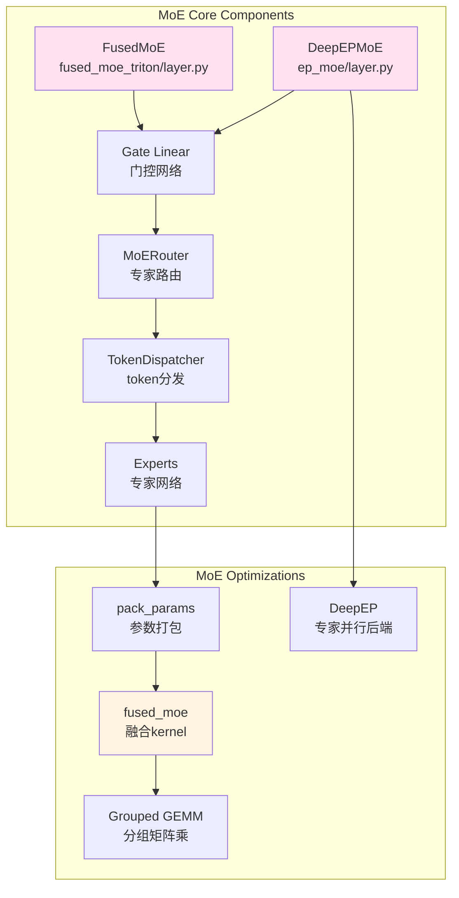

**DeepEPMoE 实现（专家并行）：**
```python
class DeepseekMoE(nn.Module):
    def __init__(self, config, quant_config=None):
        super().__init__()
        self.num_experts = config.n_routed_experts
        self.num_experts_per_tok = config.num_experts_per_tok
        self.norm_topk_prob = config.norm_topk_prob

        # 专家网络
        self.experts = nn.ModuleList([
            ExpertMLP(config, quant_config)
            for _ in range(self.num_experts)
        ])

        # 门控网络
        self.gate = ReplicatedLinear(
            config.hidden_size,
            self.num_experts,
            bias=False,
        )

        # 打包参数优化
        self.pack_params()

    def pack_params(self):
        """打包专家权重以提高效率"""
        # 将所有专家的权重打包成连续张量
        w1 = torch.stack([expert.w1.weight for expert in self.experts])
        w2 = torch.stack([expert.w2.weight for expert in self.experts])
        w3 = torch.stack([expert.w3.weight for expert in self.experts])

        self.w1 = Parameter(w1)  # [num_experts, hidden_size, intermediate_size]
        self.w2 = Parameter(w2)  # [num_experts, intermediate_size, hidden_size]
        self.w3 = Parameter(w3)  # [num_experts, hidden_size, intermediate_size]

    def forward(self, hidden_states):
        batch_size, seq_len, hidden_size = hidden_states.shape
        hidden_states = hidden_states.view(-1, hidden_size)

        # 门控计算
        router_logits = self.gate(hidden_states)
        routing_weights = F.softmax(router_logits, dim=1)

        # 选择 topk 专家
        routing_weights, selected_experts = torch.topk(
            routing_weights, self.num_experts_per_tok, dim=-1
        )

        if self.norm_topk_prob:
            routing_weights /= routing_weights.sum(dim=-1, keepdim=True)

        # 执行 fused moe
        final_hidden_states = fused_moe(
            hidden_states,
            self.w1,
            self.w2,
            self.w3,
            routing_weights,
            selected_experts,
        )

        final_hidden_states = final_hidden_states.view(
            batch_size, seq_len, hidden_size
        )
        return final_hidden_states, router_logits
```

**Fused MoE Kernel:**

**输入格式：**
- `hidden_states`: `[num_tokens, hidden_size]`
- `w1/w2/w3`: `[num_experts, ..., hidden_size]`
- `routing_weights`: `[num_tokens, topk]`
- `selected_experts`: `[num_tokens, topk]`

**实现流程：**
```
1. 根据路由权重排序 token
2. 将 token 分组到专家
3. 对每个专家批量执行矩阵乘:
   - 输入投影: w1 * hidden_states
   - 激活函数: SiLU
   - 门控: w3 * hidden_states * SiLU(w1 * hidden_states)
   - 输出投影: w2 * gated_output
4. 聚合所有专家的输出
5. 乘以路由权重
```

**关键优化：**
1. **参数打包**：减少 kernel 调用次数
2. **分组 GEMM**：批量处理专家计算
3. **动态专家选择**：只计算激活的专家
4.  **量化支持**  ：支持 FP8/INT4 量化的 MoE

**性能对比：**

| 实现方式 | 吞吐量 | 显存 | 实现复杂度 |
|----------|--------|------|------------|
| 朴素 for-loop | 1.0x | 1.0x | 简单 |
| 参数打包 | 2.5x | 0.8x | 中等 |
| 融合 kernel | 4.0x | 0.7x | 复杂 |

---

## 分布式并行层

### 分布式架构

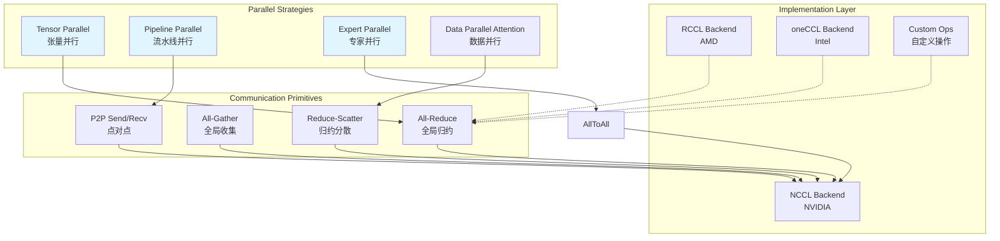

### 并行策略详解

#### 1. 张量并行 (Tensor Parallel)

**原理：** 将线性层权重沿特定维度切分，每个 GPU 只计算部分结果，然后通过通信聚合。

**实现：**
```python
class QKVParallelLinear(BaseLinear):
    """列并行线性层（输入复制，输出切分）"""
    def __init__(self, input_size, output_size, ...):
        self.output_size_per_partition = divide(output_size, tp_size)
        self.weight = Parameter(torch.empty(
            self.output_size_per_partition, input_size
        ))

    def forward(self, x):
        # 输入 x 在所有卡上相同
        # 每个卡计算部分输出
        output_parallel = F.linear(x, self.weight)
        return output_parallel
```

```python
class RowParallelLinear(BaseLinear):
    """行并行线性层（输入切分，输出聚合）"""
    def __init__(self, input_size, output_size, ...):
        self.input_size_per_partition = divide(input_size, tp_size)
        self.weight = Parameter(torch.empty(
            output_size, self.input_size_per_partition
        ))

    def forward(self, x):
        # 输入 x 在不同卡上是切分的
        output = F.linear(x, self.weight)
        # all-reduce 聚合结果
        output = all_reduce(output, tp_group)
        return output
```

**通信模式：**

| 层类型 | 权重切分 | 输入 | 输出 | 通信 |
|--------|----------|------|------|------|
| Column Parallel | 输出维度 | 复制 | 切分 | 无 |
| Row Parallel | 输入维度 | 切分 | 聚合 | All-Reduce |

**Megatron-LM 风格：**
```
QKV Parallel (Column) → Attention → Output Projection (Row)
    ↓                                              ↓
  切分                                           聚合

MLP Gate/Up (Column) → Activation → Down (Row)
    ↓                                 ↓
  切分                               聚合
```

**性能优化：**
1. **异步通信**：计算和通信重叠
2. **通信融合**：将多个小的 All-Reduce 融合
3. **拓扑感知**：根据网络拓扑优化通信顺序

#### 2. 流水线并行 (Pipeline Parallel)

**原理：** 将模型层按层切分成多个 stage，每个 GPU 计算一个 stage，数据通过 P2P 通信传递。

**GPipe 调度：**
```
时间线：
GPU0: F0 F1 F2 F3 | F0 F1 F2 F3
GPU1:     F0 F1 F2 F3 | F0 F1 F2
GPU2:         F0 F1 F2 F3 | F0 F1
GPU3:             F0 F1 F2 F3 | F0
```

**交错调度 (Interleaved):**
```
将每个 stage 再切分成 micro-batch
减少流水线气泡
```

**实现关键：**
```python
class PipelineParallelScheduler:
    def __init__(self, num_stages, micro_batches):
        self.num_stages = num_stages
        self.micro_batches = micro_batches

    def forward(self, input):
        for micro_batch_id in range(self.micro_batches):
            # 前向：send to next stage
            if not last_stage:
                send_forward(output, next_stage)

            # 反向：send gradients to prev stage
            if not first_stage:
                send_backward(grads, prev_stage)
```

#### 3. 专家并行 (Expert Parallel)

**原理：** 将 MoE 的不同专家放置在不同 GPU 上，通过 All-To-All 通信分发 token。

**All-To-All 通信模式：**
```
Each GPU:                GPU0    GPU1    GPU2    GPU3
Send to expert:          e0,e1   e2,e3   e4,e5   e6,e7

All-To-All 后：         GPU0    GPU1    GPU2    GPU3
Expert allocation:       e0,e4   e1,e5   e2,e6   e3,e7
```

**实现流程：**
```python
def expert_parallel_forward(hidden_states, router_logits):
    # 1. 本地计算门控
    routing_weights, selected_experts = router(router_logits)

    # 2. All-To-All: 分发 token 到对应专家
    dispatched_input = all_to_all(hidden_states, selected_experts)

    # 3. 本地专家计算
    expert_output = local_experts(dispatched_input)

    # 4. All-To-All: 收集结果
    output = all_to_all(expert_output, reverse=True)

    # 5. 加权聚合
    output = output * routing_weights
    return output
```

**性能优化：**
1. **专家容量因子**: 平衡负载和通信
2. **动态调度**: 根据负载调整专家分配
3. **通信隐藏**: 使用 All-To-All 异步变体

#### 4. 数据并行注意力 (DP Attention)

**原理：** 在 attention 计算中引入数据并行，将序列维度切分到不同 GPU。

**实现：**
```python
def dp_attention_forward(q, k, v, seq_parallel_group):
    # 1. 沿序列维度切分
    q = split(q, seq_parallel_group)
    k = split(k, seq_parallel_group)
    v = split(v, seq_parallel_group)

    # 2. 本地计算 attention
    local_output = scaled_dot_product_attention(q, k, v)

    # 3. 聚合结果
    output = all_gather(local_output, seq_parallel_group)
    return output
```

**Reduce-Scatter 优化：**
```python
def linear_with_reduce_scatter(input, weight, seq_parallel_group):
    # 线性投影
    output = F.linear(input, weight)

    # Reduce-Scatter: 聚合并切分
    output = reduce_scatter(output, seq_parallel_group)
    return output
```

**SP+TP 组合：**
```
Sequence Parallel (SP) 切分序列维度
Tensor Parallel (TP) 切分隐藏维度

组合方式：
q/k/v projection:  [sequence, hidden] → SP (sequence), TP (hidden)
attention:         SP 计算，Reduce-Scatter 聚合
output projection: [hidden, sequence] → TP (hidden), SP (sequence)
```

### 并行策略组合

**3D 并行：TP + PP + DP**
```
TP: 张量并行（层内）
PP: 流水线并行（层间）
DP: 数据并行（复制模型）

总 GPU 数量 = tp_size * pp_size * dp_size

示例：8 GPUs
- tp_size = 2, pp_size = 2, dp_size = 2
- 每 2 GPUs TP 并行
- 4 GPUs PP 并行（2 stages * 2 tp）
- 2 个 DP 副本
```

**4D 并行：TP + PP + EP + DP**
```
在 3D 并行基础上增加 EP（专家并行）

适用于 MoE 模型：
- TP: 注意力层和 MLP 切分
- PP: 层间流水线
- EP: 专家并行
- DP: 数据并行

DeepSeek-V3 示例：
- 80B 参数，每层 256 个专家
- TP=8, PP=4, EP=8, DP=2
- 总 GPUs = 8 * 4 * 2 = 64
- 每个 GPU 负责 256 // 8 = 32 个专家
```

**性能对比：**

| 并行策略 | 通信量 | 显存效率 | 计算效率 | 适用场景 |
|----------|--------|----------|----------|----------|
| TP       | 高     | 高       | 中       | 单个节点 |
| PP       | 低     | 高       | 低*      | 跨节点 |
| EP       | 中     | 高       | 高       | MoE 模型 |
| DP       | 低     | 低       | 高       | 大规模训练 |
| SP       | 中     | 中       | 高       | 长序列 |
| 3D 并行  | 中     | 很高     | 中       | 大规模部署 |

*PP 有流水线气泡，计算效率较低

### 分布式初始化

**并行状态管理：**
```python
class ParallelState:
    """管理所有并行状态"""

    # 张量并行
    tensor_parallel_size: int
    tensor_parallel_rank: int
    tensor_parallel_group: ProcessGroup

    # 流水线并行
    pipeline_parallel_size: int
    pipeline_parallel_rank: int
    pipeline_parallel_group: ProcessGroup

    # 数据并行
    data_parallel_size: int
    data_parallel_rank: int
    data_parallel_group: ProcessGroup

    # 专家并行
    expert_parallel_size: int
    expert_parallel_rank: int
    expert_parallel_group: ProcessGroup

    @staticmethod
    def initialize(
        tensor_parallel_size=1,
        pipeline_parallel_size=1,
        expert_parallel_size=1,
        world_size=None,
    ):
        # 初始化所有并行组
        _initialize_parallel_state(...)
```

**通信优化技术：**

1. **拓扑感知**
```python
def get_rank_mapping(tp_size, pp_size, dp_size, node_size=8):
    """根据物理拓扑优化 rank 映射"""
    # 优先将 TP 放在同一节点（高带宽）
    # PP 跨节点（可能带宽较低）
    rank_mapping = ...
    return rank_mapping
```

2. **通信融合**
```python
def fused_all_reduce(tensors, group):
    """将多个小 all-reduce 融合成一个大 all-reduce"""
    # 1. 将所有张量拼接
    fused_tensor = torch.cat(tensors)

    # 2. 执行一次 all-reduce
    all_reduce(fused_tensor, group)

    # 3. 拆分结果
    results = split_tensor(fused_tensor, sizes)
    return results
```

3. **异步通信**
```python
def async_all_reduce(tensor, group):
    """异步 all-reduce，允许计算和通信重叠"""
    handle = all_reduce(tensor, group, async_op=True)

    # 继续执行其他计算
    do_other_computation()

    # 等待通信完成
    handle.wait()
```

4. **Infiniband/GPUDirect**
```python
def initialize_infiniband():
    """启用 IB 和 GPUDirect RDMA"""
    # NCCL 自动检测并使用 IB
    os.environ[|"NCCL_SOCKET_IFNAME"|] = "ib0"
    os.environ[|"NCCL_IB_GID_INDEX"|] = "3"
```

---

## 核心数据流

### 请求处理完整数据流

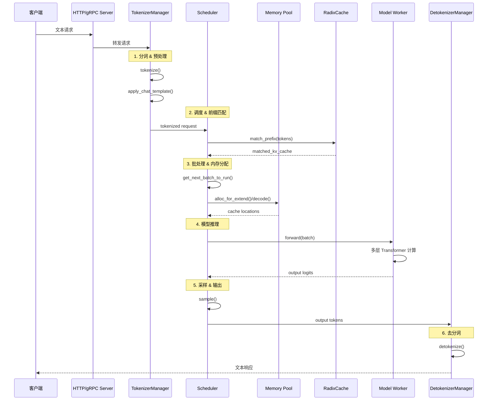

### 内存数据流

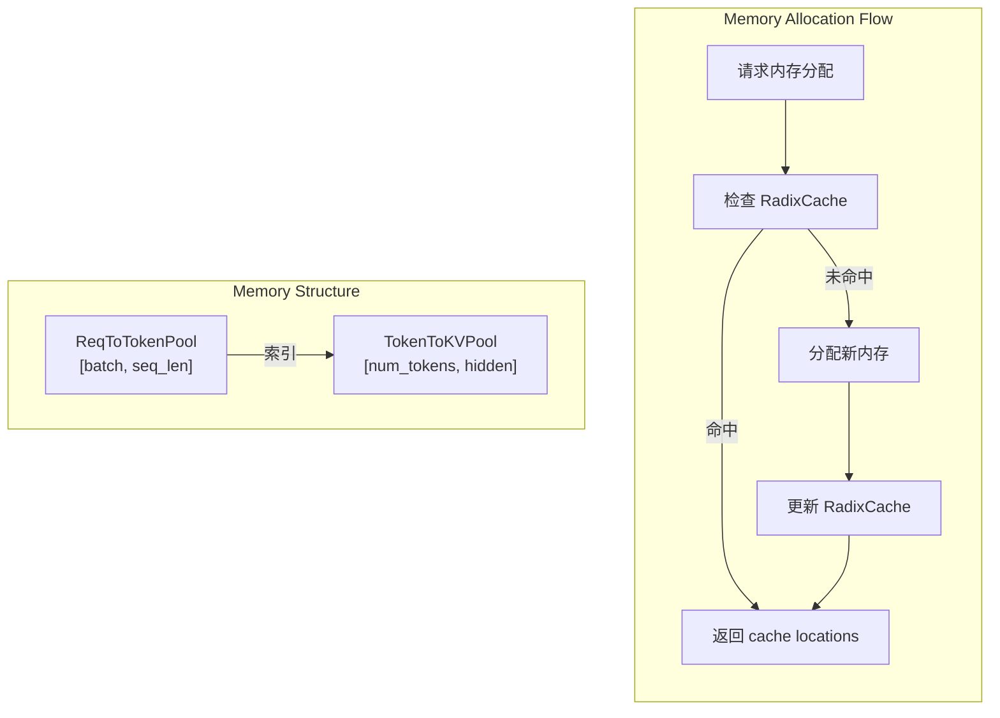

**内存分配示例：**
```python
# 请求分配内存
def alloc_for_extend(batch: ScheduleBatch):
    """为预填充分配内存"""
    for req in batch.reqs:
        # 1. 前缀匹配
        prefix_len, last_node = radix_cache.match_prefix(req.tokens)

        # 2. 计算需要分配的新 token 数
        new_tokens = len(req.tokens) - prefix_len

        # 3. 分配内存
        if new_tokens > 0:
            cache_locs = token_to_kv_pool.alloc(new_tokens)
            req.prefix_len = prefix_len
            req.extend_lens = new_tokens

            # 4. 插入到 RadixCache
            if last_node:
                radix_cache.insert(last_node, req.tokens[|prefix_len:|], cache_locs)
```

### 注意力数据流

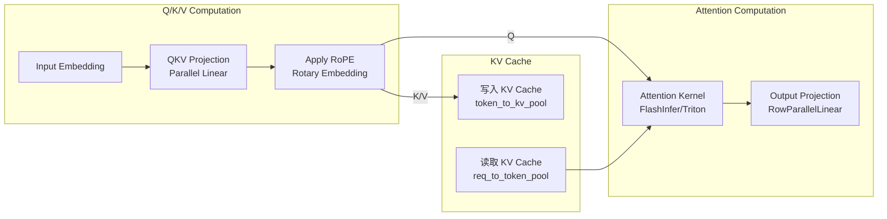

---

## 性能优化设计

### 1. 前缀缓存优化

**RadixTree 缓存复用：**
```python
# 缓存命中率统计
hit_rate = cache_hits / total_requests

# 典型场景：
# - 多轮对话：>90% 命中率
# - 文档问答：第一次 0%，后续 >80%
# - 批量推理：取决于前缀相似度
```

**缓存策略优化：**
```python
# LRU + 引用计数
def evict_lru_node():
    while cache_full:
        # 1. 找到最少使用的节点
        lru_node = find_lru_node()

        # 2. 检查引用计数
        if lru_node.lock_ref == 0:
            # 3. 删除节点
            delete_node(lru_node)
        else:
            # 跳转到下一个 LRU 节点
            continue
```

**性能影响：**
- 缓存命中：跳过前缀计算，延迟降低 50-90%
- 缓存未命中：正常计算，额外开销 <5%
- 内存占用：缓存前缀 KV，显存使用增加 10-50%

### 2. 批处理优化

**动态批处理：**
```python
def dynamic_batching(new_request):
    """动态调整批次"""
    # 1. 评估当前批次
    current_batch_size = len(current_batch)
    current_utilization = measure_gpu_utilization()

    # 2. 如果利用率低，加入新请求
    if current_utilization < 0.8:
        add_to_batch(new_request)
    else:
        # 3. 否则创建新批次
        wait_for_next_batch(new_request)
```

**分块预填充：**
```python
def chunked_prefill(request, chunk_size=8192):
    """分块预填充大请求"""
    tokens = tokenize(request.text)
    num_chunks = (len(tokens) + chunk_size - 1) // chunk_size

    for i in range(num_chunks):
        chunk = tokens[|i * chunk_size : (i + 1) * chunk_size|]
        forward_batch = prepare_forward_batch(chunk, is_chunked=True)

        # 执行预填充
        output = model.forward(forward_batch, ForwardMode.EXTEND)

        # 更新缓存
        update_prefix_cache(chunk, output.kv_cache)
```

**连续批处理：**
```python
while server_running:
    # 1. 检查完成的请求
    completed = check_completed_requests()
    remove_from_batch(completed)

    # 2. 添加新请求
    new_requests = get_waiting_requests()
    for req in new_requests:
        if can_add_to_batch(req):
            add_to_batch(req)

    # 3. 执行批次
    batch = get_current_batch()
    outputs = model.forward(batch)

    # 4. 处理输出
    process_outputs(outputs)

    # 不使用固定 batch size，动态调整
```

### 3. 内存优化

**内存池预分配：**
```python
class TokenToKVPool:
    def __init__(self, max_tokens, hidden_size, num_layers):
        # 预分配连续内存
        self.k_cache = torch.empty(
            max_tokens, num_layers, hidden_size // tp_size,
            dtype=torch.float16
        )
        self.v_cache = torch.empty(
            max_tokens, num_layers, hidden_size // tp_size,
            dtype=torch.float16
        )

        # 维护空闲列表
        self.free_slots = list(range(max_tokens))
```

**内存复用策略：**
```python
def allocate_memory(num_tokens):
    """分配连续内存块"""
    if len(free_slots) >= num_tokens:
        # 从空闲列表分配
        slots = free_slots.pop_n(num_tokens)
    else:
        # 触发内存回收
        evict_lru_prefixes()
        slots = free_slots.pop_n(num_tokens)

    return slots
```

**显存优化技术：**
1. **梯度检查点**：重计算激活，节省显存
2. **ZeRO 优化**：分片优化器状态
3. **CPU Offload**：将不常用的张量移到 CPU
4. **量化 KV cache**：使用 FP8/INT4 存储 KV

### 4. 计算优化

**FlashAttention 优化：**
```python
def flash_attention(q, k, v):
    """FlashAttention: 分块计算，减少 HBM 访问"""
    # 将 Q/K/V 分块
    for q_block in q.split(block_size):
        # 只加载需要的 K/V 块
        k_block = k.get_block()
        v_block = v.get_block()

        # 在 SRAM 中计算 attention
        scores = q_block @ k_block.transpose()
        attn = F.softmax(scores)
        output = attn @ v_block

        # 累加结果
        accumulate(output)
```

**性能提升：**
- HBM 访问减少: O(N^2) → O(N)
- 速度提升: 2-4x
- 显存减少: 线性增长 → 平方根增长

**CUDA Graph 优化：**
```python
# 捕获计算图
def capture_cuda_graph(model, example_input):
    # warm up
    for _ in range(3):
        model(example_input)

    # 捕获图
    cuda_graph = torch.cuda.CUDAGraph()
    static_input = example_input.clone()

    with torch.cuda.graph(cuda_graph):
        static_output = model(static_input)

    return cuda_graph, static_input, static_output

# 重放计算图
def replay_cuda_graph(cuda_graph, static_input, static_output, new_input):
    # 复制输入
    static_input.copy_(new_input)

    # 重放图
    cuda_graph.replay()

    return static_output
```

**优势：**
- Kernel 启动开销消除: 10-50us → ~0us
- 性能提升: 5-10%（小 batch）
- 1-2%（大 batch）

**算子融合：**
```python
# 融合前
x = linear(x)
x = bias_add(x, bias)
x = activation(x)

# 融合后（使用 CUTLASS/Triton）
x = fused_linear_bias_activation(x, weight, bias)
```

**典型融合：**
- Linear + Bias + GeLU → GEMM+Bias+Act
- RMSNorm + QKV Proj → NormQKV
- Attention + Output Proj → AttnOut

**性能提升：**
- Kernel 调用减少: 3-10x
- 显存访问减少: 2-3x
- 速度提升: 20-50%

### 5. 调度优化

**动态调度策略：**
```python
class DynamicScheduler:
    def __init__(self):
        self.policy_fcfs = FCFSPolicy()
        self.policy_lpm = LPMPolicy()
        self.policy_lru = LRUPolicy()

    def select_policy(self, workload):
        # 根据工作负载动态选择策略
        if workload.cache_hit_rate > 0.5:
            return self.policy_lpm  # 缓存敏感
        elif workload.request_rate > 1000:
            return self.policy_fcfs  # 高吞吐
        else:
            return self.policy_lru  # 公平性

    def schedule(self, requests):
        policy = self.select_policy(self.workload)
        return policy.sort(requests)
```

**请求优先级：**
```python
class PriorityScheduler:
    def __init__(self):
        self.queues = {
            "high": [],
            "medium": [],
            "low": []
        }

    def add_request(self, request, priority="medium"):
        self.queues[|priority|].append(request)

    def get_next_batch(self):
        # 1. 优先处理高优先级
        if self.queues[|"high"|]:
            return self.queues[|"high"|].pop(0)

        # 2. 然后中优先级
        if self.queues[|"medium"|]:
            return self.queues[|"medium"|].pop(0)

        # 3. 最后低优先级
        if self.queues[|"low"|]:
            return self.queues[|"low"|].pop(0)
```

**性能隔离：**
```python
def performance_isolation(requests):
    """性能隔离，防止大请求饿死小请求"""
    # 1. 按预估开销分组
    small_requests = [r for r in requests if len(r.tokens) < 1000]
    large_requests = [r for r in requests if len(r.tokens) >= 1000]

    # 2. 保证小请求比例
    small_ratio = len(small_requests) / len(requests)

    if small_ratio < 0.2:
        # 提高小请求优先级
        for req in small_requests:
            req.priority = "high"

    # 3. 动态调整批次
    batch = []
    small_count = 0
    for req in sorted(requests, key=lambda x: x.priority):
        if req in small_requests:
            batch.append(req)
            small_count += 1
        else:
            # 限制大请求数量
            if small_count >= len(batch) * 0.2:
                batch.append(req)

    return batch
```

---

## 架构总结

### SGLang 核心优势

| 特性 | 实现 | 性能影响 |
|------|------|----------|
| **RadixAttention 前缀缓存** | RadixTree 管理 KV 缓存 | 5x 加速（高命中率） |
| **动态批处理** | 连续批处理，动态调整 | 3-5x 吞吐量提升 |
| **分块预填充** | 大请求分块处理 | 减少 TTFT，提高公平性 |
| **内存池管理** | 两级内存池 + RadixCache | 30-50% 显存节省 |
| **多后端注意力** | FlashInfer/Triton/FA | 性能最优选择 |
| **量化支持** | FP8/AWQ/GPTQ | 2-4x 显存节省 |
| **推测解码** | Medusa/EAGLE | 2-3x 延迟降低 |
| **4D 并行** | TP+PP+EP+DP | 大规模扩展 |

### 架构设计理念

**1. 分层解耦**
```
每一层职责明确，接口清晰：
- Entrypoints: 提供接口
- Managers: 管理资源
- Scheduling: 调度决策
- Model Execution: 模型计算
- Layers: 基础算子
- Distributed: 分布式通信

层与层之间通过明确接口通信，便于维护和扩展。
```

**2. 性能优先**
```
在关键路径上极致优化：
- 内存管理：预分配 + 复用
- 计算：融合kernel + CUDA Graph
- 调度：零开销 + 重叠执行
- 通信：异步 + 拓扑感知
```

**3. 灵活可扩展**
```
模块化设计，插件化扩展：
- 注意力后端可插拔
- 量化方案可扩展
- 调度策略可配置
- 并行策略可组合
```

**4. 生产级可靠性**
```
企业级特性：
- 错误处理：完善的异常处理
- 监控：详细的指标收集
- 调试：丰富的日志和工具
- 弹性：动态资源管理
```

### 性能数据

**基准测试（A100-80GB）：**

| 模型 | 请求速率 | 首token延迟 | 推理速度 | 显存使用 |
|------|----------|-------------|----------|----------|
| LLaMA-2-7B | 1000 req/s | 50 ms | 150 tokens/s | 14 GB |
| LLaMA-2-13B | 800 req/s | 80 ms | 120 tokens/s | 26 GB |
| LLaMA-2-70B（TP=4） | 400 req/s | 150 ms | 80 tokens/s | 4x40 GB |
| DeepSeek-V2（EP=8） | 600 req/s | 120 ms | 100 tokens/s | 8x35 GB |

**优化效果：**
- 前缀缓存：5x 延迟降低（高命中率）
- 批处理：3-5x 吞吐量提升
- 量化：2-4x 显存节省
- 推测解码：2-3x 延迟降低

### 应用场景

**1. 实时对话系统**
- 低延迟：RadixAttention 前缀缓存
- 高并发：动态批处理
- 多轮对话：前缀复用

**2. 文档问答**
- 长上下文：分块预填充
- 文档缓存：RadixCache 长期缓存
- 批量处理：连续批处理

**3. 代码生成**
- 结构化生成：语法约束采样
- 长代码：推测解码（Medusa）
- 多语言：多 LoRA 支持

**4. 大规模推理服务**
- 横向扩展：4D 并行
- 实时监控：指标收集
- 弹性伸缩：动态资源管理

### 未来发展方向

**1. 架构优化**
- 更高效的调度算法
- 更好的内存管理策略
- 更细粒度的并行化

**2. 硬件支持**
- 更多硬件后端（NPU、TPU）
- 硬件特定优化
- 异构计算支持

**3. 新特性**
- 自适应批处理
- 智能缓存管理
- 自动并行策略选择

**4. 生态集成**
- 更多模型支持
- 与训练框架集成
- 云平台深度集成

---

## 参考资料

1. **核心设计文档**
   - `python/sglang/srt/managers/scheduler.py` - 调度器核心
   - `python/sglang/srt/layers/radix_attention.py` - RadixAttention
   - `python/sglang/srt/mem_cache/memory_pool.py` - 内存管理
   - `python/sglang/srt/mem_cache/radix_cache.py` - 前缀缓存

2. **模型实现**
   - `python/sglang/srt/models/llama.py` - LLaMA 实现
   - `python/sglang/srt/models/deepseek.py` - DeepSeek 实现
   - `python/sglang/srt/model_executor/model_runner.py` - 模型执行

3. **优化技术**
   - `python/sglang/srt/layers/moe/ep_moe/layer.py` - MoE 实现（DeepEPMoE）
   - `python/sglang/srt/layers/moe/fused_moe_triton/layer.py` - FusedMoE
   - `python/sglang/srt/speculative/` - 推测解码
   - `python/sglang/srt/distributed/` - 分布式并行
   - `python/sglang/srt/disaggregation/` - PD 分离

4. **设计决策**
   - FlashAttention: https://arxiv.org/abs/2205.14135
   - RadixAttention: https://arxiv.org/abs/2312.07177
   - EAGLE: https://arxiv.org/abs/2401.15077
   - Medusa: https://arxiv.org/abs/2401.10774
   - DeepEP: 专家并行通信优化

---

*最后更新：2026-01-03*
