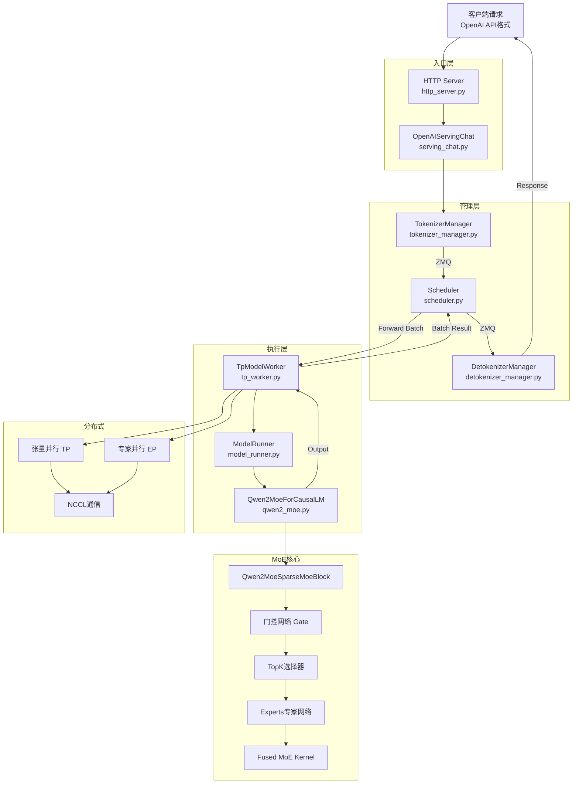
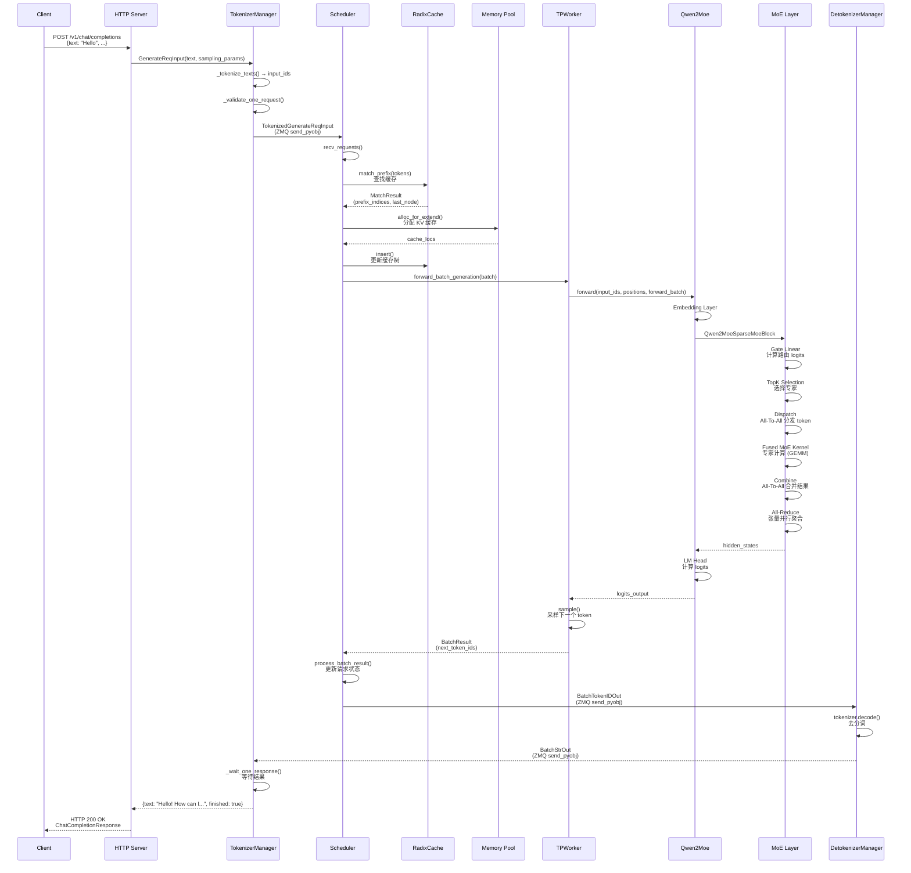

# SGLang 在线推理完整流程代码分析

> 本文档详细分析从 OpenAI chat completion HTTP API 到 MoE 模型（以 Qwen 为例）推理完成并返回的整体代码流程。
> 更新时间：2025-01-02

## 目录

1. [整体流程概览](#整体流程概览)
2. [HTTP API 入口层](#http-api-入口层)
3. [TokenizerManager 处理](#tokenizermanager-处理)
4. [Scheduler 调度核心](#scheduler-调度核心)
5. [Model Worker 执行](#model-worker-执行)
6. [MoE 模型特有路径](#moe-模型特有路径)
7. [分布式并行执行](#分布式并行执行)
8. [返回路径](#返回路径)
9. [完整代码调用链](#完整代码调用链)

---

## 整体流程概览



### 流程阶段划分

| 阶段 | 关键组件 | 主要功能 | 代码文件 |
|------|---------|---------|---------|
| 1. 请求接收 | HTTP Server, OpenAIServingChat | API路由、格式转换 | `http_server.py`, `serving_chat.py` |
| 2. 分词处理 | TokenizerManager | 文本分词、多模态处理 | `tokenizer_manager.py` |
| 3. 调度管理 | Scheduler | 批处理调度、内存分配 | `scheduler.py` |
| 4. 模型执行 | TPWorker, ModelRunner | 模型前向传播 | `tp_worker.py`, `model_runner.py` |
| 5. MoE计算 | Qwen2MoeSparseMoeBlock | 专家路由、计算 | `qwen2_moe.py` |
| 6. 分布式通信 | ParallelState, NCCL | 张量并行、专家并行 | `parallel_state.py` |
| 7. 结果返回 | DetokenizerManager | 去分词、响应生成 | `detokenizer_manager.py` |

---

## HTTP API 入口层

### 1. HTTP Server 启动

**文件**: `python/sglang/srt/entrypoints/http_server.py`

```python
def launch_server(server_args: ServerArgs):
    # 创建全局状态
    global_state = _GlobalState()

    # 初始化 TokenizerManager
    tokenizer_manager = TokenizerManager(
        server_args=server_args,
        port=server_args.port + 1,
        dp_rank=dp_rank,
    )

    # 创建 FastAPI 应用
    app = FastAPI()

    # 注册 OpenAI API 路由
    @app.post("/v1/chat/completions")
    async def openai_v1_chat_completions(
        request: ChatCompletionRequest, raw_request: Request
    ):
        return await raw_request.app.state.openai_serving_chat.handle_request(
            request, raw_request
        )
```

### 2. OpenAI Chat Completion 请求处理

**文件**: `python/sglang/srt/entrypoints/openai/serving_chat.py`

**关键流程**：

```python
class OpenAIServingChat:
    async def handle_request(
        self, request: ChatCompletionRequest, raw_request: Request
    ):
        # 1. 验证请求
        self._validate_request(request)

        # 2. 转换为内部格式
        gen_req = self._convert_to_internal_request(request)

        # 3. 处理请求（流式/非流式）
        if request.stream:
            return self._handle_streaming_request(gen_req, raw_request)
        else:
            return await self._handle_non_streaming_request(gen_req)

    def _convert_to_internal_request(self, request: ChatCompletionRequest):
        # 转换 OpenAI 格式为 GenerateReqInput
        return GenerateReqInput(
            text=prompt,
            sampling_params=sampling_params,
            stream=request.stream,
            lora_path=lora_path,
            # ... 其他字段
        )
```

### 3. 关键数据结构

**文件**: `python/sglang/srt/managers/io_struct.py`

```python
@dataclass
class GenerateReqInput:
    text: Optional[Union[List[str], str]] = None
    input_ids: Optional[Union[List[List[int]], List[int]]] = None
    image_data: Optional[MultimodalDataInputFormat] = None
    sampling_params: Optional[Union[List[Dict], Dict]] = None
    stream: bool = False
    lora_path: Optional[Union[str, List[Optional[str]]]] = None
    # ... 其他字段
```

---

## TokenizerManager 处理

### 1. 入口方法

**文件**: `python/sglang/srt/managers/tokenizer_manager.py`

```python
class TokenizerManager:
    async def generate_request(self, obj: GenerateReqInput):
        # 1. 标准化批处理
        obj.normalize_batch_and_arguments()

        # 2. 处理 LoRA 请求
        if self.server_args.enable_lora and obj.lora_path:
            obj.lora_id = await self.lora_registry.acquire(obj.lora_path)

        # 3. 处理单请求或批请求
        if obj.is_single:
            tokenized_obj = await self._tokenize_one_request(obj)
            state = self._send_one_request(obj, tokenized_obj)
            async for response in self._wait_one_response(state):
                yield response
        else:
            async for response in self._handle_batch_request(obj):
                yield response
```

### 2. 分词处理流程

```python
async def _tokenize_one_request(self, obj: GenerateReqInput):
    # 1. 处理 input_embeds
    if obj.input_embeds is not None:
        input_embeds = obj.input_embeds
        input_ids = obj.input_ids

    # 2. 处理 input_ids
    elif obj.input_ids is not None:
        input_ids = obj.input_ids

    # 3. 处理文本分词
    else:
        input_ids, _ = await self._tokenize_texts(input_text)

    # 4. 处理多模态输入
    if self.mm_processor and obj.contains_mm_input():
        mm_inputs = await self.mm_data_processor.process(...)
        if mm_inputs and "input_ids" in mm_inputs:
            input_ids = mm_inputs["input_ids"]

    # 5. 验证请求
    self._validate_one_request(obj, input_ids)

    # 6. 创建 tokenized 对象
    return TokenizedGenerateReqInput(
        input_text=input_text,
        input_ids=input_ids,
        sampling_params=obj.sampling_params,
        stream=obj.stream,
        rid=obj.rid,
        lora_id=obj.lora_id,
        # ... 其他字段
    )
```

### 3. 多模态数据处理

**异步处理器**：

```python
class AsyncMMDataProcessor:
    async def process(self, image_data=None, video_data=None, audio_data=None):
        async def _invoke():
            if self.is_async:
                # 原生异步实现
                return await self._proc_async(...)
            else:
                # 同步处理器的线程池回退
                loop = asyncio.get_running_loop()
                fn = partial(sync_fn, ...)
                return await loop.run_in_executor(self.fallback_exec, fn)

        # 并发控制
        if self.semaphore:
            async with self.semaphore:
                return await _invoke()
        return await _invoke()
```

### 4. ZMQ 通信

```python
def _send_one_request(self, obj, tokenized_obj, created_time):
    # 通过 ZMQ 发送到 Scheduler
    self.send_to_scheduler.send_pyobj(tokenized_obj)

    # 创建请求状态
    state = ReqState(
        [],
        False,
        asyncio.Event(),
        obj,
        created_time=created_time
    )
    self.rid_to_state[obj.rid] = state
    return state
```

---

## Scheduler 调度核心

### 1. 主事件循环

**文件**: `python/sglang/srt/managers/scheduler.py`

```python
class Scheduler:
    @DynamicGradMode()
    def event_loop_normal(self):
        while True:
            # 1. 接收请求
            recv_reqs = self.recv_requests()
            self.process_input_requests(recv_reqs)

            # 2. 获取下一个批次
            batch = self.get_next_batch_to_run()
            self.cur_batch = batch

            # 3. 运行批次
            if batch:
                result = self.run_batch(batch)
                self.process_batch_result(batch, result)
            else:
                self.self_check_during_idle()

            self.last_batch = batch
```

### 2. ZMQ 请求接收

```python
def recv_requests(self) -> List[Req]:
    if self.pp_rank == 0:
        if self.attn_tp_rank == 0:
            recv_reqs = []

            # 从 TokenizerManager 接收请求
            while True:
                try:
                    recv_req = self.recv_from_tokenizer.recv_pyobj(zmq.NOBLOCK)
                except zmq.ZMQError:
                    break
                if isinstance(recv_req, TokenizedGenerateReqInput):
                    recv_reqs.append(recv_req)
    return recv_reqs
```

### 3. 批处理调度策略

```python
def get_next_batch_to_run(self) -> Optional[ScheduleBatch]:
    # 1. 合并预填充批次
    if self.last_batch and self.last_batch.forward_mode.is_extend():
        self.last_batch.filter_batch()
        if not self.last_batch.is_empty():
            if self.running_batch.is_empty():
                self.running_batch = self.last_batch
            else:
                self.running_batch.merge_batch(self.last_batch)

    # 2. 获取新的预填充批次
    new_batch = self.get_new_batch_prefill()

    # 3. 决策：预填充 vs 解码
    if new_batch is not None:
        ret = new_batch  # 优先运行预填充
    else:
        if not self.running_batch.is_empty():
            self.running_batch = self.update_running_batch(self.running_batch)
            ret = self.running_batch if not self.running_batch.is_empty() else None
        else:
            ret = None

    return ret
```

### 4. 内存分配机制

#### 预填充内存分配

```python
def alloc_for_extend(batch: ScheduleBatch):
    # 1. 计算需要分配的新 token 数
    new_tokens = len(req.tokens) - prefix_len

    # 2. 分配内存
    if new_tokens > 0:
        cache_locs = token_to_kv_pool.alloc(new_tokens)

        # 3. 插入到 RadixCache
        if last_node:
            radix_cache.insert(last_node, req.tokens[prefix_len:], cache_locs)

    # 4. 写入 req_to_token_pool
    write_cache_indices(...)
```

#### 解码内存分配

```python
def alloc_for_decode(batch: ScheduleBatch, token_per_req: int):
    # 分配 KV 缓存
    out_cache_loc = alloc_token_slots(batch.tree_cache, bs * token_per_req)

    # 写入 req_to_token_pool
    batch.req_to_token_pool.write(
        (batch.req_pool_indices, locs), out_cache_loc.to(torch.int32)
    )

    return out_cache_loc
```

### 5. RadixCache 前缀缓存

```python
class RadixCache:
    def match_prefix(self, rid: str, key: RadixKey) -> MatchResult:
        # 沿树遍历，找到最长匹配前缀
        node = self.root_node
        prefix_indices = []

        for i in range(0, len(key), self.page_size):
            page_tokens = key.token_ids[i:i + self.page_size]
            plain_key = get_child_key(RadixKey(page_tokens), self.page_size)

            if plain_key in node.children:
                child = node.children[plain_key]
                prefix_indices.extend(page_tokens)
                node = child
            else:
                break

        return MatchResult(
            prefix_indices=torch.tensor(prefix_indices),
            last_node=node,
        )
```

### 6. 调度策略对比

| 策略 | 实现 | 优点 | 适用场景 |
|------|------|------|---------|
| FCFS | 按接收时间排序 | 简单公平 | 通用场景 |
| LPM | 按前缀长度排序 | 最大化缓存复用 | 长前缀场景 |
| LRU | 按访问时间排序 | 利用局部性 | 缓存管理 |

```python
def _sort_by_longest_prefix(waiting_queue: List[Req]):
    # 按前缀长度降序排序
    waiting_queue.sort(key=lambda r: -len(r.prefix_indices))
```

---

## Model Worker 执行

### 1. TPWorker 初始化

**文件**: `python/sglang/srt/managers/tp_worker.py`

```python
class TpModelWorker(BaseTpWorker):
    def __init__(self, server_args, gpu_id, tp_rank, moe_ep_rank, pp_rank, dp_rank, nccl_port):
        # 初始化模型运行器
        self.model_runner = ModelRunner(
            model_config=self.model_config,
            mem_pool_managers=self.mem_pool_managers,
            gpu_id=gpu_id,
            tp_rank=tp_rank,
            tp_size=server_args.tp_size,
            nccl_port=nccl_port,
            server_args=server_args,
        )
```

### 2. 前向传播

```python
def forward_batch_generation(self, model_worker_batch: ModelWorkerBatch):
    # 处理流水线并行
    pp_proxy_tensors = None
    if not self.pp_group.is_first_rank:
        pp_proxy_tensors = PPProxyTensors(
            self.pp_group.recv_tensor_dict(...)
        )

    # 模型前向
    logits_output, can_run_cuda_graph = self.model_runner.forward(
        forward_batch, pp_proxy_tensors=pp_proxy_tensors
    )

    # 采样
    next_token_ids = self.model_runner.sample(logits_output, forward_batch)

    return batch_result
```

### 3. ModelRunner 加载模型

**文件**: `python/sglang/srt/model_executor/model_runner.py`

```python
class ModelRunner:
    def load_model(self):
        # 1. 创建模型实例
        self.model = get_model(
            model_config=self.model_config,
            device_config=self.device_config,
            quant_config=self.quant_config,
        )

        # 2. 应用量化
        if self.quant_config:
            self.quant_config.apply_quantization(self.model)

        # 3. 初始化内存池
        self.init_memory_pool()

        # 4. 准备 CUDA Graph
        if self.server_args.enable_cuda_graph:
            self.init_cuda_graph_state()
```

### 4. Qwen-MoE 模型加载

**文件**: `python/sglang/srt/models/qwen2_moe.py`

```python
class Qwen2MoeForCausalLM(nn.Module):
    def __init__(self, config, quant_config=None):
        self.model = Qwen2MoeModel(config, quant_config)
        self.lm_head = ParallelLMHead(config.vocab_size, config.hidden_size)
        self.logits_processor = LogitsProcessor(config)

    def forward(self, input_ids, positions, forward_batch: ForwardBatch):
        hidden_states = self.model(input_ids, positions, forward_batch)
        logits = self.lm_head(hidden_states)
        return logits
```

---

## MoE 模型特有路径

### 1. MoE Block 结构

**文件**: `python/sglang/srt/models/qwen2_moe.py`

**位置**: line 132

```python
class Qwen2MoeSparseMoeBlock(nn.Module):
    def __init__(self, layer_id, config, quant_config=None):
        # 门控网络
        self.gate = ReplicatedLinear(
            config.hidden_size,
            config.num_experts,
            bias=False,
        )

        # TopK 选择器
        self.topk = TopK(
            top_k=config.num_experts_per_tok,
            renormalize=config.norm_topk_prob,
        )

        # 专家网络
        self.experts = get_moe_impl_class(quant_config)(
            layer_id=layer_id,
            top_k=config.num_experts_per_tok,
            num_experts=config.num_experts,
            hidden_size=config.hidden_size,
            intermediate_size=config.moe_intermediate_size,
            quant_config=quant_config,
        )

        # 共享专家
        if config.shared_expert_intermediate_size > 0:
            self.shared_expert = Qwen2MoeMLP(...)
```

### 2. MoE 前向传播流程

```python
def forward(self, hidden_states, forward_batch=None):
    # 1. 输入预处理
    num_tokens, hidden_dim = hidden_states.shape
    hidden_states = hidden_states.view(-1, hidden_dim)

    # 2. DeepEP 模式检查
    if get_moe_a2a_backend().is_deepep():
        return self._forward_deepep(hidden_states, forward_batch)

    # 3. 双流优化（小批量）
    if self.alt_stream and tokens <= 1024 and get_is_capture_mode():
        final_hidden_states, shared_output = self.forward_normal_dual_stream(...)
    else:
        # 标准前向
        shared_output = self._forward_shared_experts(hidden_states)
        final_hidden_states = self._forward_router_experts(hidden_states)

    # 4. 结果合并
    if shared_output is not None:
        final_hidden_states = final_hidden_states + shared_output

    # 5. 张量并行 All-Reduce
    if self.tp_size > 1 and not use_reduce_scatter:
        final_hidden_states = tensor_model_parallel_all_reduce(final_hidden_states)

    return final_hidden_states.view(num_tokens, hidden_dim)
```

### 3. 门控网络计算

```python
def _forward_router_experts(self, hidden_states):
    # 1. 计算路由 logits
    router_logits, _ = self.gate(hidden_states)  # (num_tokens, n_experts)

    # 2. TopK 专家选择
    topk_output = self.topk(hidden_states, router_logits)

    # 3. 专家计算
    return self.experts(hidden_states, topk_output)
```

### 4. TopK 选择逻辑

```python
class TopK(CustomOp):
    def forward(self, hidden_states, router_logits):
        return select_experts(
            hidden_states=hidden_states,
            router_logits=router_logits,
            topk_config=self.topk_config,
        )
```

### 5. Fused MoE Kernel

**文件**: `python/sglang/srt/layers/moe/fused_moe_triton/fused_moe_triton_kernels.py`

**位置**: line 76

```python
@triton.jit
def fused_moe_kernel_gptq_awq(
    a_ptr, b_ptr, c_ptr,  # 输入/输出张量
    b_scale_ptr, b_zp_ptr,  # 量化参数
    topk_weights_ptr, sorted_token_ids_ptr, expert_ids_ptr,  # TopK 信息
    N, K, EM, num_valid_tokens,  # 矩阵维度
    stride_am, stride_ak, stride_be, stride_bk, stride_bn,  # 步长
    BLOCK_SIZE_M, BLOCK_SIZE_N, BLOCK_SIZE_K,  # 块大小
    top_k, compute_type, has_zp, use_int4_w4a16,  # 元参数
    filter_expert,  # 专家过滤
):
    # 1. 程序 ID 映射到 C 的块
    pid = tl.program_id(axis=0)

    # 2. 专家过滤
    off_experts = tl.load(expert_ids_ptr + pid_m)
    if filter_expert and off_experts == -1:
        write_zeros_to_output(...)  # 写入零值
        return

    # 3. 创建 A 和 B 的指针
    offs_token = tl.load(sorted_token_ids_ptr + offs_token_id)
    a_ptrs = a_ptr + (offs_token[:, None] // top_k * stride_am + offs_k[None, :] * stride_ak)

    # 4. 执行矩阵乘法（GEMM）
    # ... 计算逻辑
```

### 6. 专家并行（EP）

**文件**: `python/sglang/srt/layers/moe/fused_moe_triton/layer.py`

**FusedMoE 类位置**: line 104

```python
class DeepEPMoE(FusedMoE):
    def forward(self, hidden_states, topk_output):
        # 1. 分发阶段（Dispatch）- All-To-All
        dispatch_output = self.dispatch(hidden_states, topk_output)

        # 2. MoE 核心计算
        output = self.run_moe_core(dispatch_output, down_gemm_overlap_args)

        # 3. 合并阶段（Combine）- All-To-All
        return self.combine(output.hidden_states, topk_ids, topk_weights)
```

---

## 分布式并行执行

### 1. ParallelState 初始化

**文件**: `python/sglang/srt/distributed/parallel_state.py`

```python
def initialize_model_parallel(
    tensor_model_parallel_size: int = 1,
    expert_model_parallel_size: int = 1,
    pipeline_model_parallel_size: int = 1,
):
    # 1. 构建 TP 组：相邻 GPU 组成 TP 组
    for i in range(num_tensor_model_parallel_groups):
        ranks = list(range(i*tp_size, (i+1)*tp_size))
        group_ranks.append(ranks)

    # 2. 构建 PP 组：跨 TP 组构建 PP 组
    for i in range(num_pipeline_model_parallel_groups):
        ranks = list(range(i, world_size, num_pipeline_model_parallel_groups))
        group_ranks.append(ranks)

    # 3. 初始化 MoE EP/TP 组
    initialize_expert_model_and_tensor_parallel()
```

### 2. All-Reduce 通信

```python
def all_reduce(self, input_: torch.Tensor):
    # 多层次优化选择
    if self.ca_comm and self.ca_comm.should_custom_ar(input_):
        return torch.ops.sglang.outplace_all_reduce(input_, "ca")
    elif self.qr_comm and self.qr_comm.should_quick_allreduce(input_):
        return torch.ops.sglang.outplace_all_reduce(input_, "qr")
    elif self.pymscclpp_comm:
        return torch.ops.sglang.outplace_all_reduce(input_, "pymscclpp")
    elif self.torch_symm_mem_comm:
        return torch.ops.sglang.outplace_all_reduce(input_, "torch_symm_mem")
    else:
        torch.ops.sglang.inplace_all_reduce(input_, group_name=self.unique_name)
```

### 3. All-To-All 通信（专家并行）

```python
class StandardDispatcher:
    def dispatch(self, hidden_states, topk_output):
        if self.moe_ep_size > 1:
            # 专家 ID 转换
            topk_output = topk_output._replace(
                topk_ids=self.local_expert_mapping[topk_output.topk_ids]
            )

        return StandardDispatchOutput(hidden_states=hidden_states, topk_output=topk_output)
```

### 4. 权重加载

```python
def update_weights_from_distributed(self, names, dtypes, shapes, group_name):
    # 通过分布式组接收权重
    for name, dtype, shape in zip(names, dtypes, shapes):
        tensor = torch.empty(shape, dtype=dtype, device=self.device)
        torch.distributed.broadcast(tensor, src=0, group=self._model_update_group[group_name])
        # 更新模型参数
        self.model.update_weights({name: tensor})
```

---

## 返回路径

### 1. 结果处理

```python
def process_batch_result(self, batch: ScheduleBatch, result: GenerationBatchResult):
    # 1. 更新请求状态
    for i, req in enumerate(batch.reqs):
        req.output_tokens.append(result.next_token_ids[i].item())
        req.check_finished()

    # 2. 发送给 DetokenizerManager
    if self.detokenizer_manager:
        self.send_to_detokenizer.send_pyobj(
            BatchTokenIDOut(
                rids=[req.rid for req in finished_reqs],
                output_tokens=[req.output_tokens for req in finished_reqs],
            )
        )
```

### 2. 去分词处理

**文件**: `python/sglang/srt/managers/detokenizer_manager.py`

```python
class DetokenizerManager:
    def process_batch_result(self, batch_token_id_out: BatchTokenIDOut):
        for rid, output_tokens in zip(batch_token_id_out.rids, batch_token_id_out.output_tokens):
            # 去分词
            output_text = self.tokenizer.decode(output_tokens, skip_special_tokens=True)

            # 发送响应给 TokenizerManager
            send_to_tokenizer.send_pyobj(
                BatchStrOut(
                    rids=[rid],
                    output_str=[output_text],
                )
            )
```

### 3. 返回客户端

```python
class TokenizerManager:
    async def _wait_one_response(self, state: ReqState):
        while True:
            # 等待结果
            await state.event.wait()
            state.event.clear()

            # 组装响应
            out = state.out_list[-1]
            if isinstance(out, BatchStrOut):
                # 流式响应
                if state.obj.stream:
                    yield {
                        "text": output_text,
                        "finished": finished,
                    }
                # 最终响应
                else:
                    return {
                        "text": output_text,
                        "meta_info": { ... },
                    }
```

---

## 完整代码调用链

### 1. 调用链（按时间顺序）

```
1. 客户端请求
   ↓
2. HTTP Server (http_server.py:1100)
   - openai_v1_chat_completions()
   ↓
3. OpenAIServingChat (serving_chat.py:81)
   - handle_request()
   - _convert_to_internal_request()
   ↓
4. TokenizerManager (tokenizer_manager.py:405)
   - generate_request()
   - _tokenize_one_request() (586)
   - _tokenize_texts() (506)
   - _send_one_request() (923)
   - send_pyobj() → ZMQ → Scheduler
   ↓
5. Scheduler (scheduler.py:958)
   - event_loop_normal()
   - recv_requests() (需要搜索)
   - get_next_batch_to_run() (1630)
   - alloc_for_extend() / alloc_for_decode() (mem_cache/common.py:320/420)
   - match_prefix() (mem_cache/radix_cache.py:251)
   - run_batch() (需要搜索)
   - forward_batch_generation() (tp_worker.py:61)
   ↓
6. ModelRunner (model_runner.py:需要搜索)
   - forward()
   - model.forward() (实际模型)
   ↓
7. Qwen2MoeForCausalLM (models/qwen2_moe.py:需要搜索)
   - forward()
   - self.model()
   ↓
8. Qwen2MoeModel (models/qwen2_moe.py:需要搜索)
   - forward()
   - self.layers[i]()   # 多层循环
   ↓
9. Qwen2MoeDecoderLayer (models/qwen2_moe.py:需要搜索)
   - forward()
   - self.self_attn()
   - self.mlp()         # MoE层
   ↓
10. Qwen2MoeSparseMoeBlock (models/qwen2_moe.py:132/264)
    - forward()
    - self.gate()        # 门控 (在 models/qwen2_moe.py)
    - self.topk()        # TopK选择 (在 layers/moe/topk.py)
    - self.experts()     # 专家计算 (在 layers/moe/fused_moe_triton/)
    ↓
11. FusedMoE (layers/moe/fused_moe_triton/layer.py:104)
    - forward() (832)
    - select_experts()   (在 layers/moe/topk.py)
    - fused_moe_kernel_gptq_awq() (fused_moe_triton_kernels.py:76)  # Triton Kernel
    ↓
12. 返回路径
    - 结果返回 TPWorker
    - process_batch_result() (scheduler.py:需要搜索)
    - send_to_detokenizer.send_pyobj()
    - DetokenizerManager.process_batch_result()
    - send_to_tokenizer.send_pyobj()
    - TokenizerManager._wait_one_response()
    - HTTP 响应
```

### 2. 关键代码行号

| 组件 | 关键方法 | 文件 | 行号 |
|------|---------|------|------|
| HTTP Server | openai_v1_chat_completions | http_server.py | 1099 |
| OpenAI Serving | handle_request | serving_chat.py | 81 |
| TokenizerManager | generate_request | tokenizer_manager.py | 405 |
| TokenizerManager | _tokenize_one_request | tokenizer_manager.py | 586 |
| TokenizerManager | _send_one_request | tokenizer_manager.py | 923 |
| Scheduler | event_loop_normal | scheduler.py | 958 |
| Scheduler | get_next_batch_to_run | scheduler.py | 1630 |
| Memory Pool | alloc_for_extend | mem_cache/common.py | 320 |
| Memory Pool | alloc_for_decode | mem_cache/common.py | 420 |
| RadixCache | match_prefix | mem_cache/radix_cache.py | 251 |
| TPWorker | forward_batch_generation | tp_worker.py | 61 |
| Qwen2MoeSparseMoeBlock | __init__ | models/qwen2_moe.py | 132 |
| Qwen2MoeSparseMoeBlock | forward | models/qwen2_moe.py | 264 |
| Qwen2MoeSparseMoeBlock | _forward_shared_experts | models/qwen2_moe.py | 207 |
| Qwen2MoeSparseMoeBlock | _forward_router_experts | models/qwen2_moe.py | 243 |

### 3. 数据流和控制流



---

## 性能关键路径

### 1. 高影响优化点

| 优化点 | 实现位置 | 性能提升 | 原理 |
|-------|---------|---------|------|
| **RadixCache 前缀缓存** | `mem_cache/radix_cache.py` | 5x 延迟降低 | 复用 KV 缓存，跳过前缀计算 |
| **连续批处理** | `managers/scheduler.py` | 3-5x 吞吐提升 | 动态合并请求，提高 GPU 利用率 |
| **Fused MoE Kernel** | `layers/moe/fused_moe_triton/` | 4x 速度提升 | Triton 实现，专家计算融合 |
| **All-To-All 优化** | `layers/moe/ep_moe/` | 2x EP 通信 | 异步通信，拓扑感知 |
| **张量并行** | `distributed/parallel_state.py` | 线性扩展 | 列并行 + 行并行 |
| **CUDA Graph** | `model_executor/model_runner.py` | 5-10% 加速 | Kernel 启动开销消除 |

### 2. MoE 模型特有优化

1. **专家选择优化**
   - TopK 算法选择：fused_topk / grouped_topk
   - 专家偏置：biased_grouped_topk
   - 门控网络：ReplicatedLinear（无 TP）

2. **专家计算优化**
   - 参数打包：连续内存布局
   - 块大小对齐：moe_align_block_size
   - 专家过滤：跳过非本地专家

3. **通信优化**
   - All-To-All 批处理：合并小消息
   - 异步通信：计算与通信重叠
   - 拓扑感知：节点内优先

4. **内存优化**
   - 动态专家选择：只计算激活专家
   - 共享专家：路由 + 共享并行
   - KV 缓存复用：RadixTree 管理

---

## 常见问题与调试

### 1. 如何追踪请求流程

```bash
# 启用详细日志
export SGLANG_LOG_LEVEL=DEBUG

# 关键日志点
# - TokenizerManager: 分词完成
# - Scheduler: 批处理调度
# - MoE Layer: 专家选择
# - TPWorker: All-Reduce 完成
```

### 2. 性能分析

```python
# 使用 PyTorch Profiler
with torch.profiler.profile(...) as prof:
    model.forward(batch)

prof.export_chrome_trace("trace.json")

# 关键指标
# - 前缀缓存命中率
# - MoE 专家负载均衡
# - All-To-All 通信时间
# - Kernel 执行时间
```

### 3. 调试技巧

1. **单 GPU 调试**
   ```bash
   python -m sglang.launch_server --model-path Qwen/Qwen2-57B-A14B --tp 1
   ```

2. **禁用优化**
   ```bash
   export SGLANG_DISABLE_FLASHINFER=1  # 禁用 FlashInfer
   export SGLANG_DISABLE_CUDA_GRAPH=1  # 禁用 CUDA Graph
   ```

3. **打印中间状态**
   ```python
   # 在 MoE forward 中打印
   print(f"Router logits shape: {router_logits.shape}")
   print(f"TopK IDs: {topk_output.topk_ids}")
   print(f"Expert counts: {expert_counts}")
   ```

---

## 参考资料

### 核心文件

1. **入口层**
   - `python/sglang/srt/entrypoints/http_server.py` - HTTP 服务器
   - `python/sglang/srt/entrypoints/openai/serving_chat.py` - OpenAI API 实现

2. **管理层**
   - `python/sglang/srt/managers/tokenizer_manager.py` - 分词管理
   - `python/sglang/srt/managers/scheduler.py` - 调度核心
   - `python/sglang/srt/managers/detokenizer_manager.py` - 去分词管理

3. **执行层**
   - `python/sglang/srt/managers/tp_worker.py` - 张量并行工作进程
   - `python/sglang/srt/model_executor/model_runner.py` - 模型运行器

4. **MoE 实现**
   - `python/sglang/srt/models/qwen2_moe.py` - Qwen2 MoE 模型 (Qwen2MoeSparseMoeBlock)
   - `python/sglang/srt/layers/moe/topk.py` - TopK 选择逻辑
   - `python/sglang/srt/layers/moe/fused_moe_triton/` - Fused MoE Kernel 实现
     - `fused_moe_triton_kernels.py` - Triton kernels
     - `layer.py` - FusedMoE 基础类
   - `python/sglang/srt/layers/moe/deepseek_moe.py` - DeepSeek MoE
   - `python/sglang/srt/layers/moe/ep_moe/` - 专家并行

5. **基础组件**
   - `python/sglang/srt/mem_cache/memory_pool.py` - 内存池管理
   - `python/sglang/srt/mem_cache/radix_cache.py` - 前缀缓存
   - `python/sglang/srt/mem_cache/common.py` - 内存分配函数
   - `python/sglang/srt/layers/attention/` - 注意力后端
   - `python/sglang/srt/distributed/` - 分布式并行

### 相关论文

1. **RadixAttention**: https://arxiv.org/abs/2312.07177
2. **FlashAttention**: https://arxiv.org/abs/2205.14135
3. **EAGLE**: https://arxiv.org/abs/2401.15077
4. **Medusa**: https://arxiv.org/abs/2401.10774
5. **MoE**: https://arxiv.org/abs/2101.03961 (Switch Transformers)

### 外部链接

- SGLang 官方文档: https://docs.sglang.io/
- GitHub 仓库: https://github.com/sgl-project/sglang
- 性能基准: https://github.com/sgl-project/sglang/tree/main/benchmark

---

## 总结

本文档详细分析了从 OpenAI chat completion HTTP API 到 MoE 模型推理的完整流程，涵盖了：

1. **HTTP API 层**: FastAPI 路由、OpenAI 格式转换
2. **TokenizerManager**: 文本分词、多模态处理、ZMQ 通信
3. **Scheduler**: 事件循环、批处理调度、内存管理、RadixCache
4. **Model Worker**: 模型加载、前向传播、采样
5. **MoE 模型**: 门控网络、TopK 选择、专家并行、Fused Kernel
6. **分布式**: 张量并行、专家并行、All-To-All 通信
7. **返回路径**: 结果处理、去分词、HTTP 响应

**关键性能优化**：
- RadixCache 前缀缓存（5x 加速）
- 连续批处理（3-5x 吞吐）
- Fused MoE Kernel（4x 速度）
- All-To-All 优化（2x 通信）
